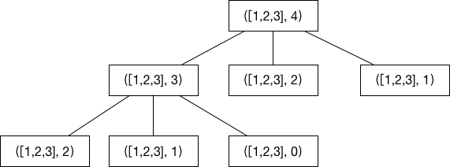

# Combination Sum IV

## Detail

Given an integer array with all positive numbers and no duplicates, find the number of possible combinations that add up to a positive integer target.

Example:

```
nums = [1, 2, 3]
target = 4

The possible combination ways are:
(1, 1, 1, 1)
(1, 1, 2)
(1, 2, 1)
(1, 3)
(2, 1, 1)
(2, 2)
(3, 1)

Note that different sequences are counted as different combinations.

Therefore the output is 7.
```

## 暴力法

使用递归，如下图



根据上图中的规律可以得到如下递归公式:

```
F(target) =  F(target-nums[0]) + F(target- num[1]) + ... + F(target - nums[len(nums)-1])
```

```go
package main

import "fmt"

func combinationSum4(nums []int, target int) int {
        if target == 0 {
                return 1
        }

        if target < 0 {
                return 0
        }

        result := 0
        for _, v := range nums {
                result += combinationSum4(nums, target-v)
        }
        return result

}

func main() {
        nums := []int{1, 2, 3}
        target := 4
        fmt.Println(combinationSum4(nums, target))

}
```

## 动态规划

从上图中的可以看到非常多的重复的子问题，比如 combinationSum4(nums, 2), 就被重复计算了几次。我们可以从下往上计算，每次计算出来的结果都保存起来，这样就不用重复计算。具体代码如下:

```go

package main

import "fmt"

func combinationSum4(nums []int, target int) int {
        dp := make([]int, target+1)
        dp[0] = 1

        for i := 1; i <= target; i++ {
                for _, v := range nums {
                        if i-v >= 0 {
                                dp[i] += dp[i-v]
                        }
                }
        }
        return dp[target]
}
func main() {
        nums := []int{1, 2, 3}
        target := 4
        fmt.Println(combinationSum4(nums, target))

}
```

