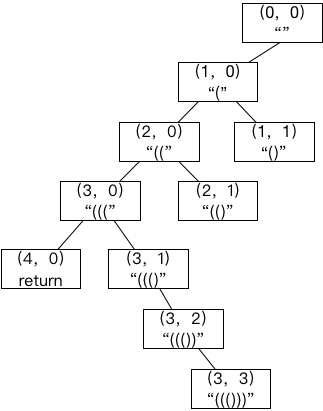

# generate parentheses

## Detail

Given n pairs of parentheses, write a function to generate all combinations of well-formed parentheses.

For example, given n = 3, a solution set is:

```
[
  "((()))",
  "(()())",
  "(())()",
  "()(())",
  "()()()"
]
```

## 暴力枚举

使用回溯，列举出所有的可能，然后再判断是不是合法的parentheses, 不过会做非常多的无用工作.

## 回源加剪枝



```go

package main

import "fmt"

func generateParenthesis(n int) []string {
        var result []string
        var dfs func(left, right int, sol []byte)

        dfs = func(left, right int, sol []byte) {
                if left == n && right == n {
                        result = append(result, string(sol))
                }

                if left > n || right > n || right > left {
                        return
                }

                if left > right {
                        dfs(left+1, right, append(sol, '('))
                        dfs(left, right+1, append(sol, ')'))
                }

                if left == right {
                        dfs(left+1, right, append(sol, '('))
                }
        }

        dfs(0, 0, nil)
        return result
}

func main() {
        fmt.Println(generateParenthesis(3))
}
```

将上述代码简化如下:


```go
package main

import "fmt"

func generateParenthesis(n int) []string {
        var result []string
        var dfs func(left, right int, sol []byte)

        dfs = func(left, right int, sol []byte) {
                if left == n && right == n {
                        result = append(result, string(sol))
                }

                if left > n || right > n || right > left {
                        return
                }

                dfs(left+1, right, append(sol, '('))
                dfs(left, right+1, append(sol, ')'))

        }
        dfs(0, 0, nil)
        return result
}

func main() {
        fmt.Println(generateParenthesis(3))
}
```

